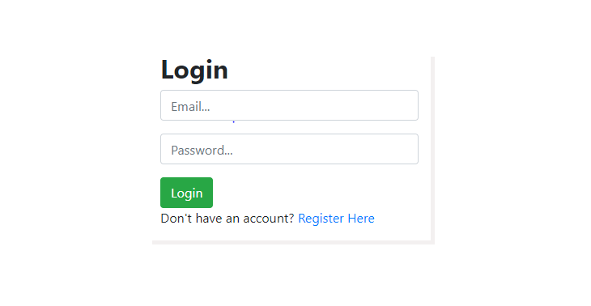
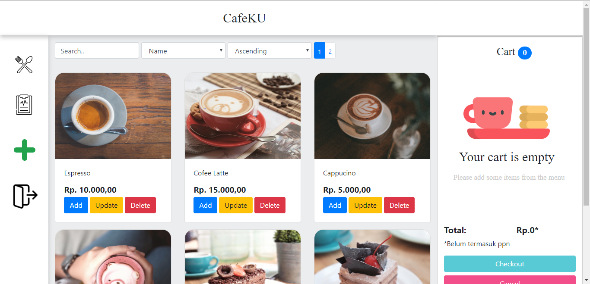
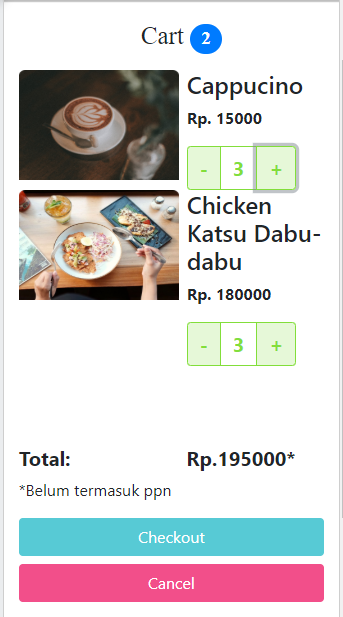
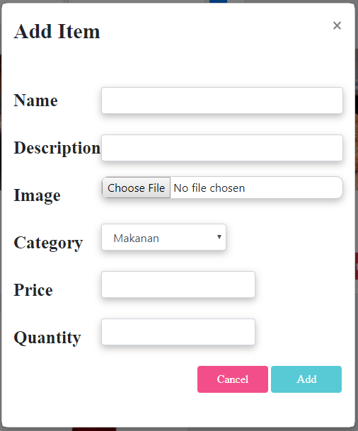
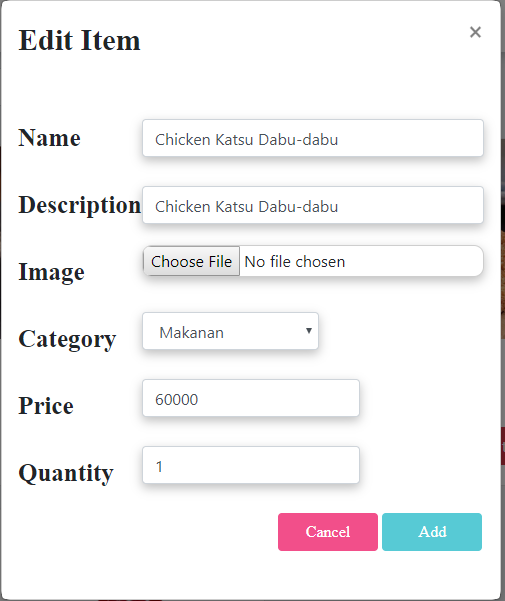
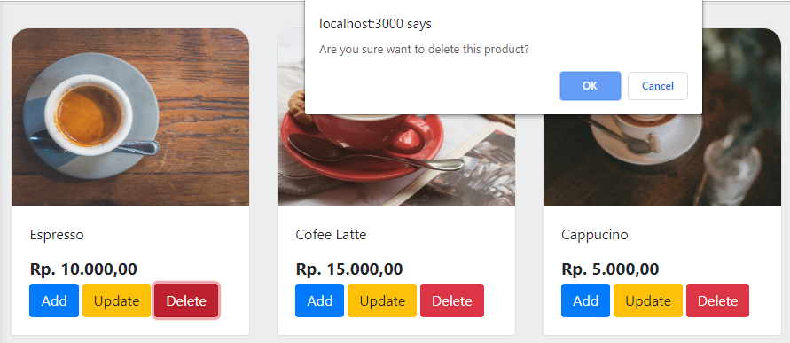
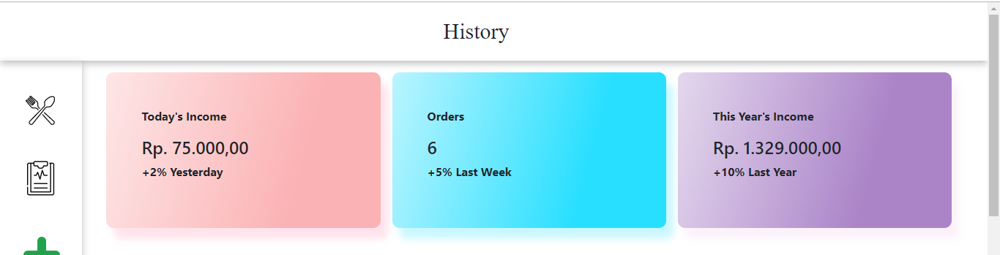
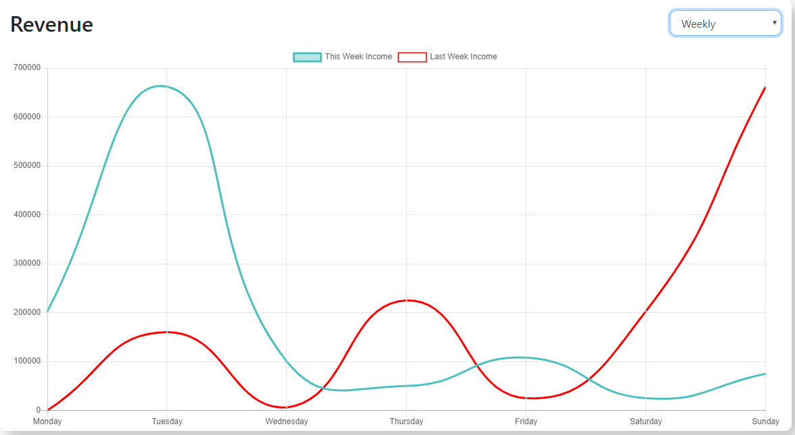
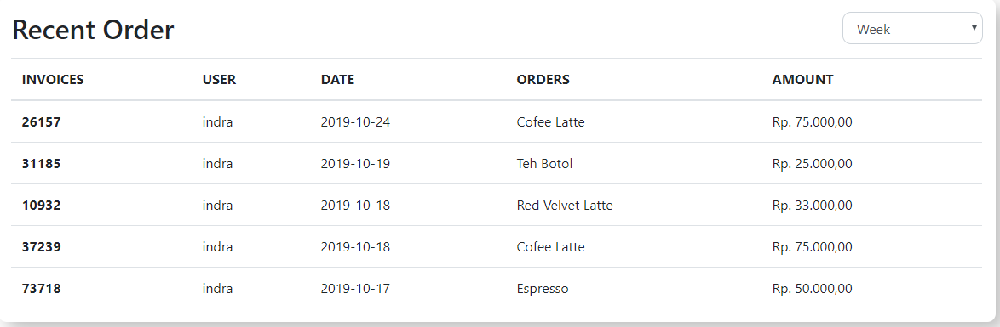

# Point Of Sales Cafeku 

## Table Of Contents

  - [Introduction](#introduction)
  - [Requirements](#requirments)
  - [Installation](#installation)
  - [Dependencies](#dependencies)
  - [Features](#features)
  
___

## Introduction

Cafeku is a point of sales of cafe. the main use of this application is to take order from customer easier and faster.

___

## Requirments

* [Nodejs](https://nodejs.org/en/) v10 LTS version
* [Npm](https://www.npmjs.com/get-npm) package / [Yarn](https://yarnpkg.com/lang/en/docs/install/#mac-stable) package
* [reactstrap](https://reactstrap.github.io/)
___
 
## Installation

### Clone

```sh
$ git clone https://github.com/indrajuni96/react-point-of-sales-cafeku.git
$ cd point-of-sale-cafeku-master
```
---
### Install Depedencies

```sh
$ npm install
```
---
### Run server development

```sh
$ npm start
```
---

## Dependencies

| Plugin |
| ------ |
| Axios |
| Bootstrap |
| React-Chartjs-2 |
| React-Router-Dom |
| Redux |
| Redux-promise-middleware |
| Rupiah-format |

___

## Features

* Get ALL products
* Order products
* Search, sort, pagination product
* Add product
* Edit product
* Delete product
* Shopping cart
* History order

___

## Screenshots

### Screen Login



### Screen Home



### Screen Add To Cart



### Screen Add Product



### Screen Edit Product



### Screen Delete Product



### Screen History Card



### Screen History Revenue



### Screen History Recent Order

